# Criando um DER através do Workbench

Após criarmos a base de dados `techsolutions`:

```sql
CREATE DATABASE IF NOT EXISTS techosolutions_db;
USE techosolutions_db;
CREATE TABLE clientes (
    id_cliente INT PRIMARY KEY AUTO_INCREMENT,
    nome VARCHAR(100) NOT NULL,
    cpf VARCHAR(14) UNIQUE,
    telefone VARCHAR(20),
    email VARCHAR(100)
);
CREATE TABLE funcionarios (
    id_funcionario INT PRIMARY KEY AUTO_INCREMENT,
    nome VARCHAR(100) NOT NULL,
    cargo VARCHAR(50),
    telefone VARCHAR(20)
);
CREATE TABLE ordens_servicos (
    id_os INT PRIMARY KEY AUTO_INCREMENT,
    data_abertura DATE NOT NULL,
    descricao TEXT,
    id_cliente INT,
    id_funcionario INT,
    FOREIGN KEY (id_cliente) REFERENCES clientes(id_cliente),
    FOREIGN KEY (id_funcionario) REFERENCES funcionarios(id_funcionario)
);
```

Através do Workbench podemos gerar o diagrama de entidade e relacionamento.

## 1. Conectar no banco

1. Abrir o MySQL Workbench
2. Clicar na conexão local
3. Verificar se o banco techosolutions_db está criado

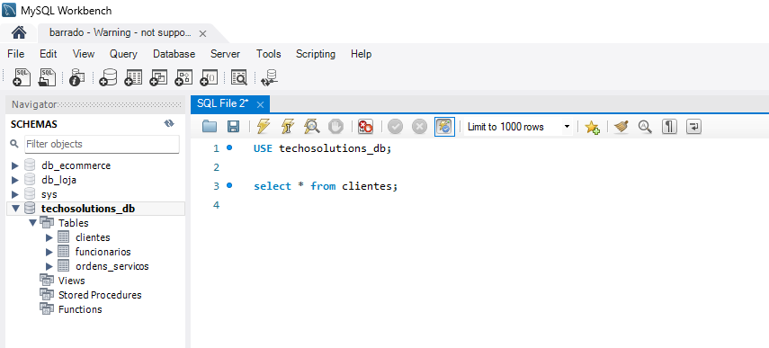

## 2. Fazer o Reverse Engineering

No `Workbench`clique em:

1. Database → Reverse Engineer
2. Escolher a conexão
3. Next
4. Selecionar o schema techosolutions_db
5. Next até finalizar

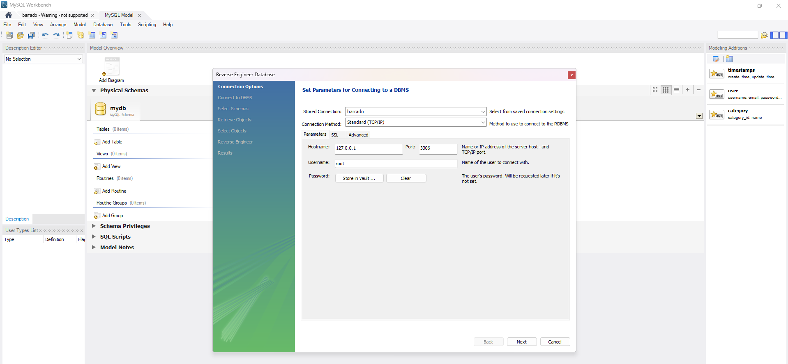

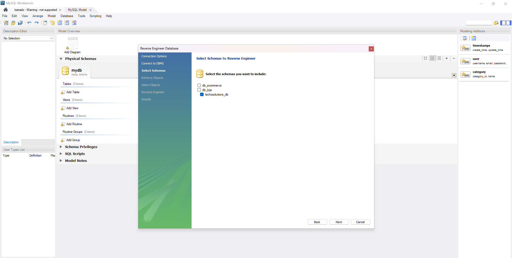

O Workbench vai:
* Ler as tabelas
* Ler as chaves primárias
* Ler as chaves estrangeiras
* Criar um modelo EER automaticamente

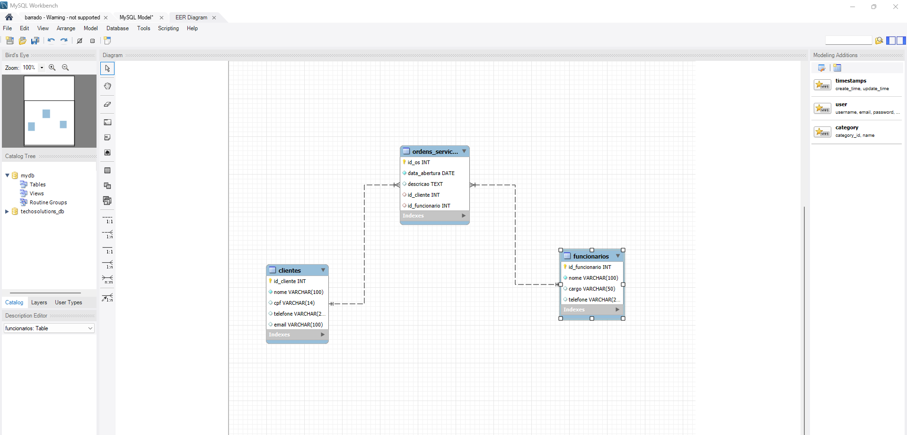

## Criar um novo Diagrama no Workbench

Criar diagramas EER no MySQL WorkBench é algo bastante simples. A criação pode ser feita de um dos três modos:

Criar um novo diagrama EER
Criar a partir de uma base de dados existente
Criar a partir de um script
Criar um novo diagrama EER
Para criar um um novo diagrama EER basta ir carregar no ‘+’ junto a Models (isto no separador principal)

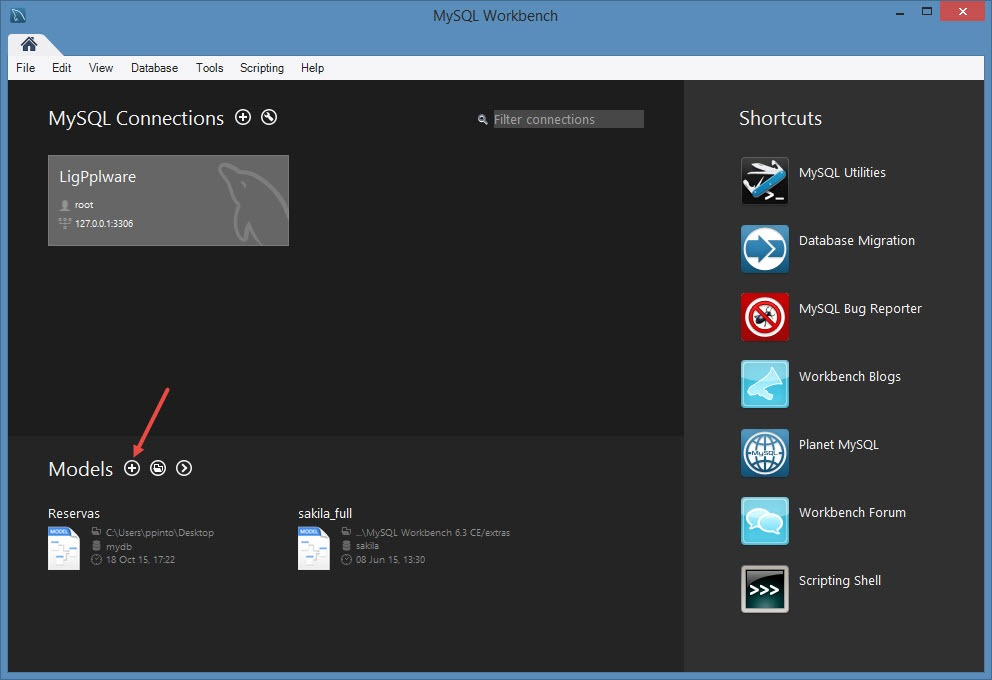

Depois basta carregar em “Add Diagram” para proceder à criação de um novo diagrama EER.

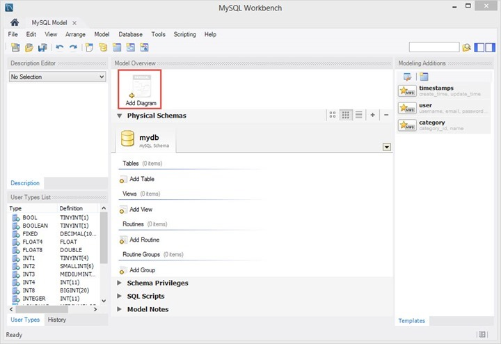

Depois basta criar as tabelas, indicar os campos e estabelecer as respectivas relacções (1:1, 1:N, N:M).

Para criar tabelas basta carregar no seguinte ícone na barra lateral.

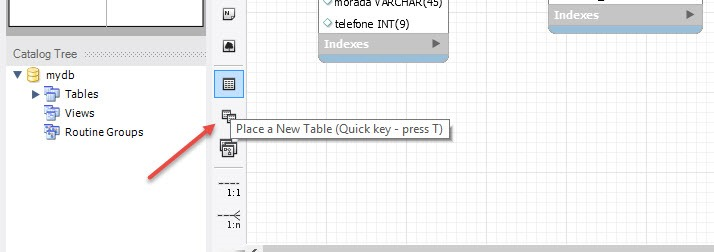

Depois devem indicar um nome para a tabela (ex. Quarto) e definir quais os campos que fazem parte dessa tabela.

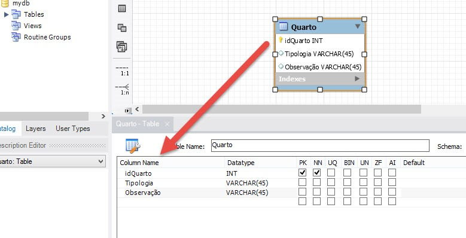

 Definir os relacionamentos entre tabelas. As ligações estão também na barra lateral esquerda. O resultado final será algo semelhante ao apresentado em baixo.

 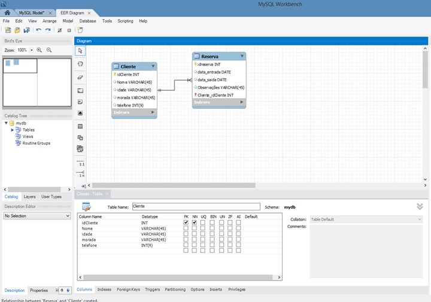

 Depois de criado o diagrama EER é possível exportá-lo para um script SQL ou até inseri-lo directo no SGBD.

 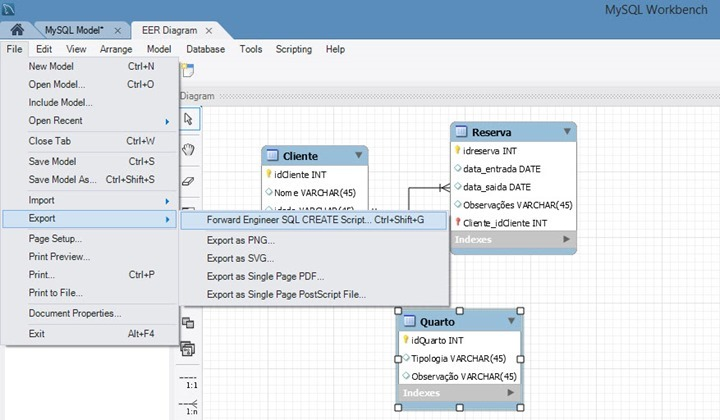

 ## 📘 Atividade Prática – Modelagem e Criação de DER

 ### 🕹️ Situação-Problema

A empresa GameStore Tech é uma loja especializada na venda de jogos digitais e produtos relacionados a consoles.

Atualmente, a empresa precisa desenvolver o banco de dados do seu sistema interno para organizar:

* Os produtos vendidos
* As categorias dos produtos
* Os usuários cadastrados na plataforma

A equipe de TI foi contratada para criar o modelo do banco de dados antes da implementação física.

Você faz parte dessa equipe.

### Objetivo da Atividade

Criar o Diagrama Entidade-Relacionamento (DER) representando a estrutura do banco de dados da empresa.

# Requisitos do Sistema - Loja de Jogos

## 1. Visão Geral
Sistema para gerenciamento de uma loja de jogos com controle de usuários, produtos e categorias.

## 2. Entidades do Sistema

### 🔹 2.1 Categorias (tb_categorias)
Tabela responsável por armazenar as categorias dos produtos.

| Campo | Tipo | Descrição |
|-------|------|-----------|
| id | INT (PK) | Identificador único da categoria |
| tipo | VARCHAR | Nome da categoria (ex: Ação, Aventura, Esporte) |

**Relacionamentos:**
- Uma categoria pode ter vários produtos
- Relação 1:N com a tabela tb_produtos

### 🔹 2.2 Usuários (tb_usuarios)
Tabela responsável por armazenar os dados dos usuários do sistema.

| Campo | Tipo | Descrição |
|-------|------|-----------|
| id | INT (PK) | Identificador único do usuário |
| nome | VARCHAR | Nome completo do usuário |
| usuario | VARCHAR | Nome de login do usuário (único) |
| senha | VARCHAR | Senha de acesso (deve ser armazenada de forma segura) |
| foto | VARCHAR | Caminho/URL da foto do usuário |
| data_nascimento | DATE | Data de nascimento do usuário |

**Relacionamentos:**
- Um usuário pode cadastrar vários produtos
- Relação 1:N com a tabela tb_produtos

### 🔹 2.3 Produtos (tb_produtos)
Tabela responsável por armazenar os produtos disponíveis na loja.

| Campo | Tipo | Descrição |
|-------|------|-----------|
| id | INT (PK) | Identificador único do produto |
| nome | VARCHAR | Nome do produto/jogo |
| descricao | TEXT | Descrição detalhada do produto |
| console | VARCHAR | Console/plataforma do jogo |
| quantidade | INT | Quantidade em estoque |
| preco | DECIMAL(10,2) | Preço do produto |
| foto | VARCHAR | Caminho/URL da foto do produto |
| categoria_id | INT (FK) | Referência para a tabela tb_categorias |
| usuario_id | INT (FK) | Referência para a tabela tb_usuarios |

**Relacionamentos:**
- Muitos produtos pertencem a uma categoria
- Muitos produtos são cadastrados por um usuário

## 3. Relacionamentos entre Entidades


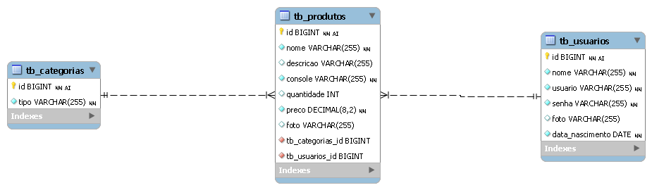

